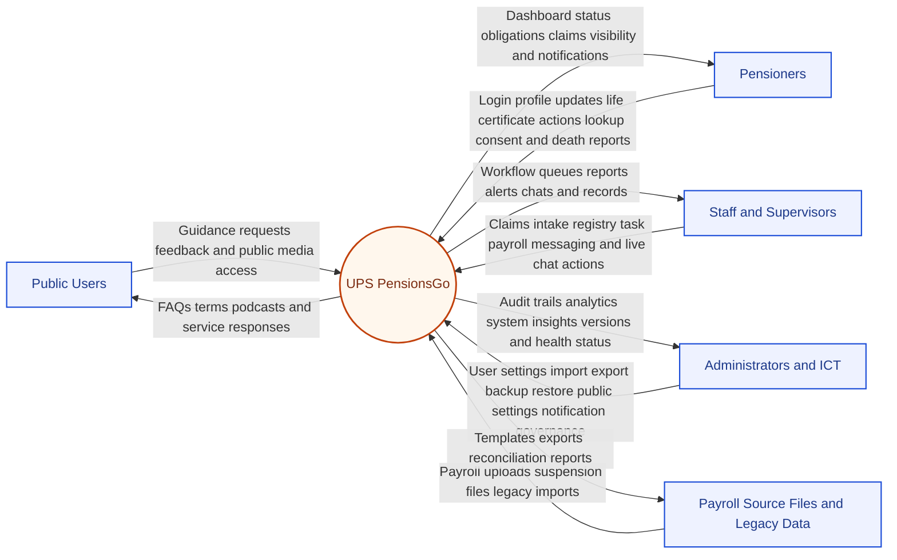

# DFD Level 0 - Context Diagram

This context-level DFD shows UPS PensionsGo as a single system interacting with its major external actors.

```mermaid
flowchart LR
  classDef external fill:#eef2ff,stroke:#1d4ed8,color:#1e3a8a,stroke-width:1.5px;
  classDef process fill:#fff7ed,stroke:#c2410c,color:#7c2d12,stroke-width:2px;

  Public[Public Users]
  Pensioners[Pensioners]
  Staff[Staff and Supervisors]
  Admin[Administrators and ICT]
  Payroll[Payroll Source Files and Legacy Data]
  P0((UPS PensionsGo))

  Public -->|Guidance requests feedback and public media access| P0
  P0 -->|FAQs terms podcasts and service responses| Public

  Pensioners -->|Login profile updates life certificate actions lookup consent and death reports| P0
  P0 -->|Dashboard status obligations claims visibility and notifications| Pensioners

  Staff -->|Claims intake registry task payroll messaging and live chat actions| P0
  P0 -->|Workflow queues reports alerts chats and records| Staff

  Admin -->|User settings import export backup restore public settings notification governance| P0
  P0 -->|Audit trails analytics system insights versions and health status| Admin

  Payroll -->|Payroll uploads suspension files legacy imports| P0
  P0 -->|Templates exports reconciliation reports| Payroll

  class Public,Pensioners,Staff,Admin,Payroll external;
  class P0 process;
```
