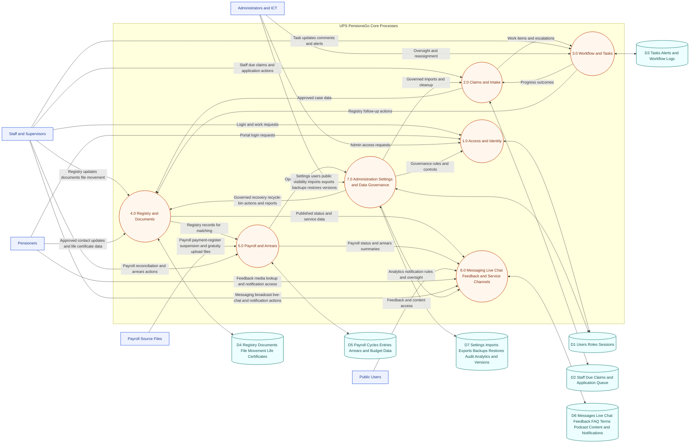

# DFD Level 1 - System Overview

This Level 1 DFD decomposes UPS PensionsGo into its main internal processing domains and shared data stores.

```mermaid
flowchart LR
  classDef external fill:#eef2ff,stroke:#1d4ed8,color:#1e3a8a,stroke-width:1.3px;
  classDef process fill:#fff7ed,stroke:#c2410c,color:#7c2d12,stroke-width:1.6px;
  classDef store fill:#ecfeff,stroke:#0f766e,color:#134e4a,stroke-width:1.4px;

  Public[Public Users]
  Pensioners[Pensioners]
  Staff[Staff and Supervisors]
  Admin[Administrators and ICT]
  Payroll[Payroll Source Files]

  subgraph Core_Processes[UPS PensionsGo Core Processes]
    direction TB
    P1((1.0 Access and Identity))
    P2((2.0 Claims and Intake))
    P3((3.0 Workflow and Tasks))
    P4((4.0 Registry and Documents))
    P5((5.0 Payroll and Arrears))
    P6((6.0 Messaging Live Chat Feedback and Service Channels))
    P7((7.0 Administration Settings and Data Governance))
  end

  D1[(D1 Users Roles Sessions)]
  D2[(D2 Staff Due Claims and Application Queue)]
  D3[(D3 Tasks Alerts and Workflow Logs)]
  D4[(D4 Registry Documents File Movement Life Certificates)]
  D5[(D5 Payroll Cycles Entries Arrears and Budget Data)]
  D6[(D6 Messages Live Chat Feedback FAQ Terms Podcast Content and Notifications)]
  D7[(D7 Settings Imports Exports Backups Restores Audit Analytics and Versions)]

  Staff -->|Login and work requests| P1
  Pensioners -->|Portal login requests| P1
  Admin -->|Admin access requests| P1
  P1 <--> D1

  Staff -->|Staff due claims and application actions| P2
  P2 <--> D2
  P2 -->|Work items and escalations| P3
  P2 -->|Approved case data| P4

  Staff -->|Task updates comments and alerts| P3
  Admin -->|Oversight and reassignment| P3
  P3 <--> D3
  P3 -->|Progress outcomes| P2
  P3 -->|Registry follow-up actions| P4

  Staff -->|Registry updates documents file movement| P4
  Pensioners -->|Approved contact updates and life certificate data| P4
  P4 <--> D4
  P4 -->|Registry records for matching| P5
  P4 -->|Published status and service data| P6

  Payroll -->|Payroll payment-register suspension and gratuity upload files| P5
  Staff -->|Payroll reconciliation and arrears actions| P5
  P5 <--> D5
  P5 -->|Payroll status and arrears summaries| P6
  P5 -->|Operational reports| P7

  Public -->|Feedback and content access| P6
  Pensioners -->|Feedback media lookup and notification access| P6
  Staff -->|Messaging broadcast live-chat and notification actions| P6
  P6 <--> D6

  Admin -->|Settings users public visibility imports exports backups restores versions| P7
  P7 <--> D7
  P7 <--> D1
  P7 -->|Governance rules and controls| P1
  P7 -->|Governed imports and cleanup| P2
  P7 -->|Governed recovery recycle-bin actions and reports| P4
  P7 -->|Analytics notification rules and oversight| P6

  class Public,Pensioners,Staff,Admin,Payroll external;
  class P1,P2,P3,P4,P5,P6,P7 process;
  class D1,D2,D3,D4,D5,D6,D7 store;
```
