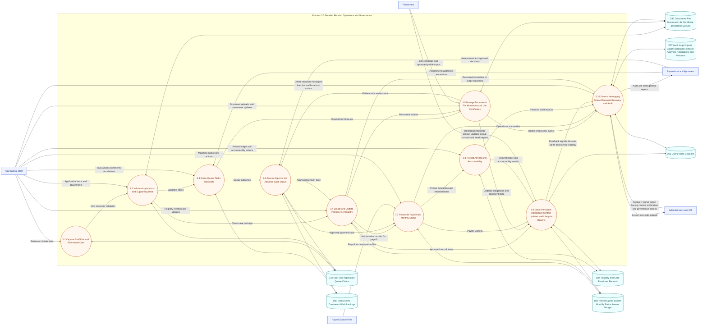

# DFD Level 3 - Detailed Pension Operations and Governance

This Level 3 DFD expands the core pension case-management backbone that sits inside the broader UPS PensionsGo platform. It traces how intake, queue routing, registry control, payroll reconciliation, pensioner service, messaging, lifecycle reporting, and deletion governance interact at a detailed operational level.

