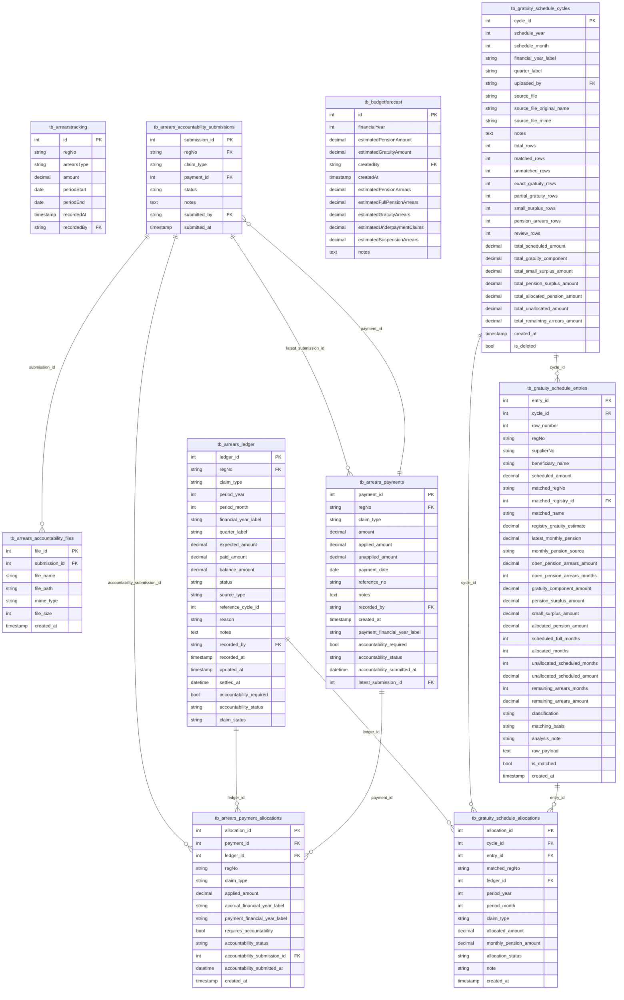

# Arrears ERD

Generated from `database/schema.sql` on 2026-05-28.

Arrears ledgers, payments, allocations, accountability, and gratuity-schedule analysis.

- Tables: 10
- Relationships shown: 10

## Tables Covered

- `tb_arrearstracking`
- `tb_budgetforecast`
- `tb_arrears_ledger`
- `tb_arrears_payments`
- `tb_arrears_payment_allocations`
- `tb_arrears_accountability_submissions`
- `tb_arrears_accountability_files`
- `tb_gratuity_schedule_cycles`
- `tb_gratuity_schedule_entries`
- `tb_gratuity_schedule_allocations`

## Mermaid ERD

