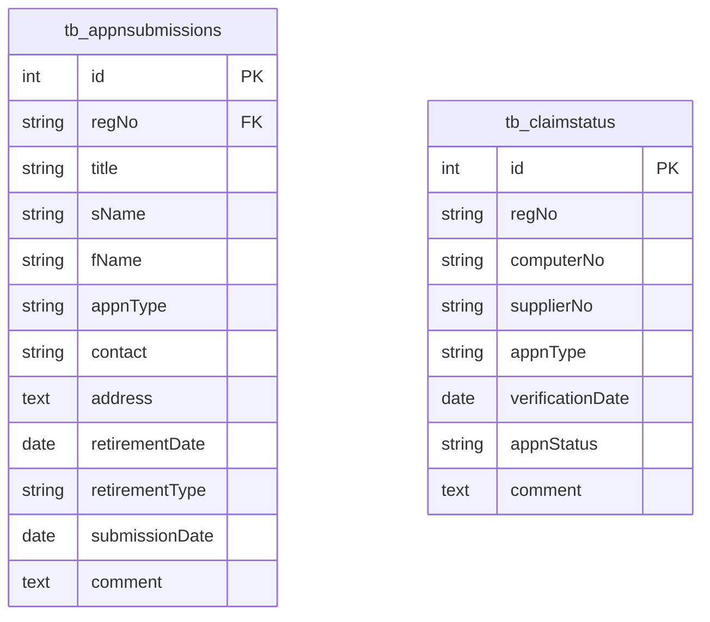

# Claims ERD

Generated from `database/schema.sql` on 2026-05-28.

Claim submissions and claim-status tracking.

- Tables: 2
- Relationships shown: 0

## Tables Covered

- `tb_appnsubmissions`
- `tb_claimstatus`

## Mermaid ERD

