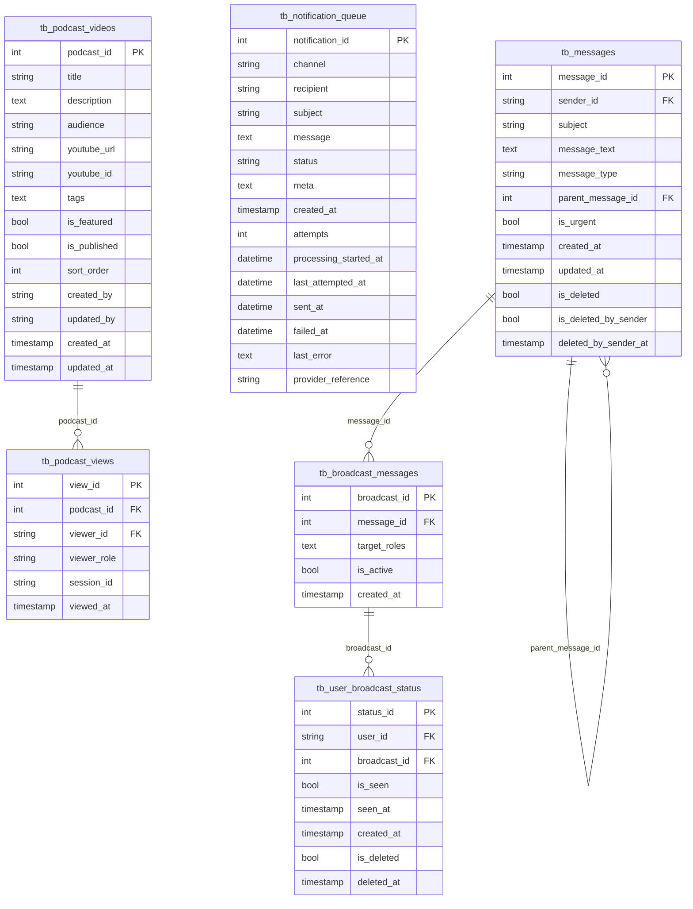

# Content & Engagement ERD

Generated from `database/schema.sql` on 2026-05-28.

Podcast publishing, views, broadcasts, and notification-facing engagement records.

- Tables: 6
- Relationships shown: 4

## Tables Covered

- `tb_podcast_videos`
- `tb_podcast_views`
- `tb_broadcast_messages`
- `tb_user_broadcast_status`
- `tb_notification_queue`
- `tb_messages`

## Mermaid ERD

