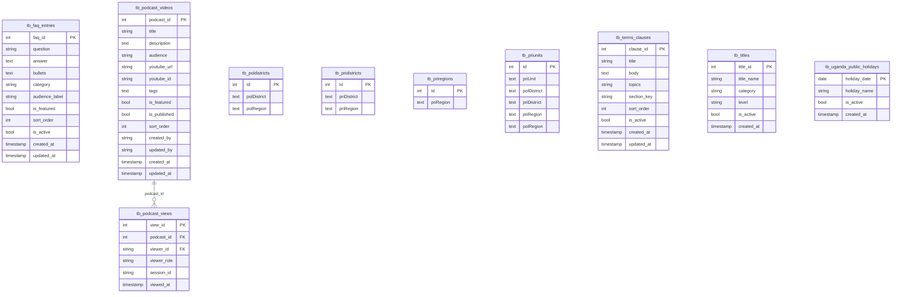

# Content & Reference ERD

Generated from `database/schema.sql` on 2026-05-28.

Titles, public guidance content, lookup/reference catalogs, and podcast metadata.

- Tables: 10
- Relationships shown: 1

## Tables Covered

- `tb_titles`
- `tb_faq_entries`
- `tb_terms_clauses`
- `tb_poldistricts`
- `tb_pridistricts`
- `tb_priregions`
- `tb_priunits`
- `tb_uganda_public_holidays`
- `tb_podcast_videos`
- `tb_podcast_views`

## Mermaid ERD

