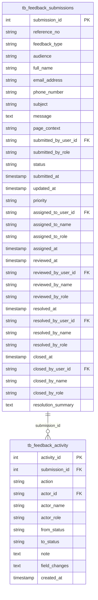

# Feedback ERD

Generated from `database/schema.sql` on 2026-05-28.

Feedback submissions and activity history.

- Tables: 2
- Relationships shown: 1

## Tables Covered

- `tb_feedback_submissions`
- `tb_feedback_activity`

## Mermaid ERD

