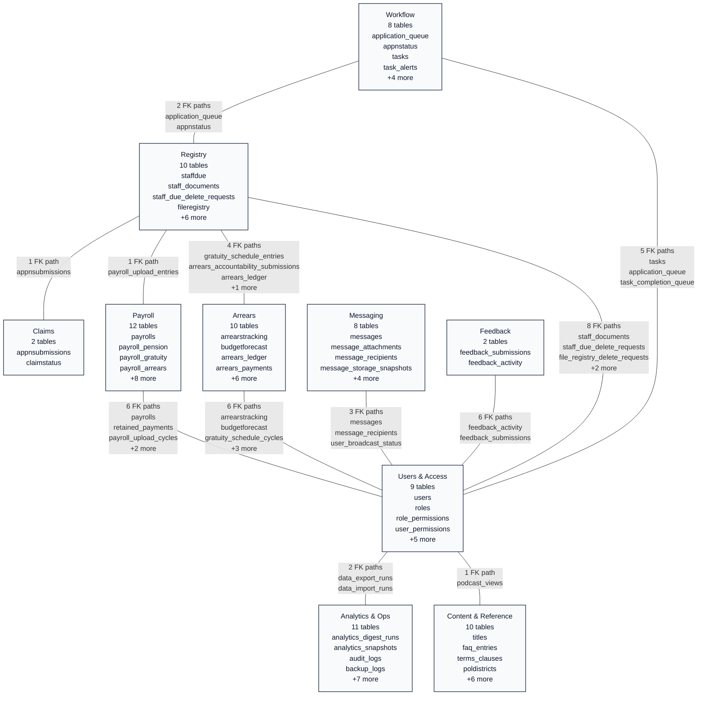

# Inter-Domain ERD

Generated from `database/schema.sql`. This map shows how the grouped domains connect through foreign-key paths and shared bridge tables.

## Domain Coverage

| Code | Domain | Tables |
| --- | --- | ---: |
| `WRK` | Workflow | 8 |
| `REG` | Registry | 10 |
| `CLM` | Claims | 2 |
| `PAY` | Payroll | 12 |
| `ARR` | Arrears | 10 |
| `MSG` | Messaging | 8 |
| `FBK` | Feedback | 2 |
| `UAC` | Users & Access | 9 |
| `OPS` | Analytics & Ops | 11 |
| `CNT` | Content & Reference | 10 |

## Connector Details

| Domain Pair | Connector Tables | Foreign-Key Paths |
| --- | --- | --- |
| Workflow <-> Registry | `tb_application_queue`, `tb_appnstatus` | `tb_application_queue.staffdue_id` -> `tb_staffdue.id` `tb_appnstatus.regNo` -> `tb_staffdue.regNo` |
| Workflow <-> Users & Access | `tb_tasks`, `tb_application_queue`, `tb_task_completion_queue` | `tb_tasks.createdBy` -> `tb_users.userId` `tb_tasks.sentTo` -> `tb_users.userId` `tb_application_queue.verified_by` -> `tb_users.userId` `tb_application_queue.submitted_by` -> `tb_users.userId` `tb_task_completion_queue.owner_user_id` -> `tb_users.userId` |
| Registry <-> Claims | `tb_appnsubmissions` | `tb_appnsubmissions.regNo` -> `tb_staffdue.regNo` |
| Registry <-> Payroll | `tb_payroll_upload_entries` | `tb_payroll_upload_entries.matched_registry_id` -> `tb_fileregistry.id` |
| Registry <-> Arrears | `tb_gratuity_schedule_entries`, `tb_arrears_accountability_submissions`, `tb_arrears_ledger`, `tb_arrears_payments` | `tb_gratuity_schedule_entries.matched_registry_id` -> `tb_fileregistry.id` `tb_arrears_accountability_submissions.regNo` -> `tb_fileregistry.regNo` `tb_arrears_ledger.regNo` -> `tb_fileregistry.regNo` `tb_arrears_payments.regNo` -> `tb_fileregistry.regNo` |
| Registry <-> Users & Access | `tb_staff_documents`, `tb_staff_due_delete_requests`, `tb_file_registry_delete_requests`, `tb_file_registry_recycle_bin`, `tb_life_certificate_submissions` | `tb_staff_documents.uploaded_by` -> `tb_users.userId` `tb_staff_due_delete_requests.requested_by` -> `tb_users.userId` `tb_staff_due_delete_requests.processed_by` -> `tb_users.userId` `tb_file_registry_delete_requests.requested_by` -> `tb_users.userId` `tb_file_registry_delete_requests.processed_by` -> `tb_users.userId` `tb_file_registry_recycle_bin.deleted_by` -> `tb_users.userId` `tb_file_registry_recycle_bin.restored_by` -> `tb_users.userId` `tb_life_certificate_submissions.submitted_by` -> `tb_users.userId` |
| Payroll <-> Users & Access | `tb_payrolls`, `tb_retained_payments`, `tb_payroll_upload_cycles`, `tb_payroll_audit_logs`, `tb_suspension_upload_cycles` | `tb_payrolls.uploaded_by` -> `tb_users.userId` `tb_retained_payments.recorded_by` -> `tb_users.userId` `tb_payroll_upload_cycles.uploaded_by` -> `tb_users.userId` `tb_payroll_upload_cycles.deleted_by` -> `tb_users.userId` `tb_payroll_audit_logs.actor_user_id` -> `tb_users.userId` `tb_suspension_upload_cycles.uploaded_by` -> `tb_users.userId` |
| Arrears <-> Users & Access | `tb_arrearstracking`, `tb_budgetforecast`, `tb_gratuity_schedule_cycles`, `tb_arrears_accountability_submissions`, `tb_arrears_ledger`, `tb_arrears_payments` | `tb_arrearstracking.recordedBy` -> `tb_users.userId` `tb_budgetforecast.createdBy` -> `tb_users.userId` `tb_gratuity_schedule_cycles.uploaded_by` -> `tb_users.userId` `tb_arrears_accountability_submissions.submitted_by` -> `tb_users.userId` `tb_arrears_ledger.recorded_by` -> `tb_users.userId` `tb_arrears_payments.recorded_by` -> `tb_users.userId` |
| Messaging <-> Users & Access | `tb_messages`, `tb_message_recipients`, `tb_user_broadcast_status` | `tb_messages.sender_id` -> `tb_users.userId` `tb_message_recipients.recipient_user_id` -> `tb_users.userId` `tb_user_broadcast_status.user_id` -> `tb_users.userId` |
| Feedback <-> Users & Access | `tb_feedback_activity`, `tb_feedback_submissions` | `tb_feedback_activity.actor_id` -> `tb_users.userId` `tb_feedback_submissions.submitted_by_user_id` -> `tb_users.userId` `tb_feedback_submissions.assigned_to_user_id` -> `tb_users.userId` `tb_feedback_submissions.reviewed_by_user_id` -> `tb_users.userId` `tb_feedback_submissions.resolved_by_user_id` -> `tb_users.userId` `tb_feedback_submissions.closed_by_user_id` -> `tb_users.userId` |
| Users & Access <-> Analytics & Ops | `tb_data_export_runs`, `tb_data_import_runs` | `tb_data_export_runs.created_by` -> `tb_users.userId` `tb_data_import_runs.created_by` -> `tb_users.userId` |
| Users & Access <-> Content & Reference | `tb_podcast_views` | `tb_podcast_views.viewer_id` -> `tb_users.userId` |
