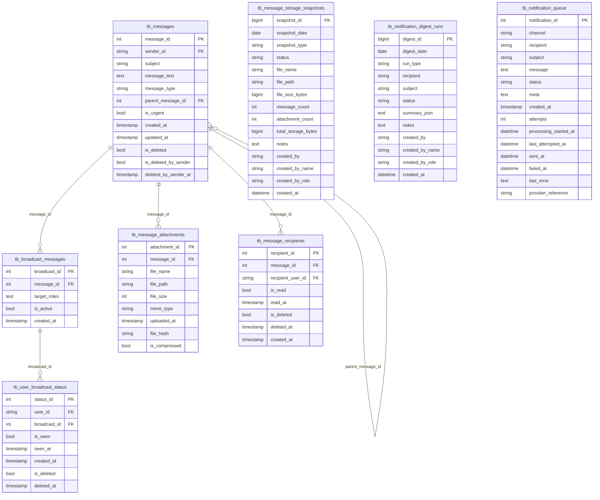

# Messaging ERD

Generated from `database/schema.sql` on 2026-05-28.

Messages, attachments, recipients, notifications, and broadcast delivery state.

- Tables: 8
- Relationships shown: 5

## Tables Covered

- `tb_messages`
- `tb_message_attachments`
- `tb_message_recipients`
- `tb_message_storage_snapshots`
- `tb_notification_queue`
- `tb_notification_digest_runs`
- `tb_broadcast_messages`
- `tb_user_broadcast_status`

## Mermaid ERD

