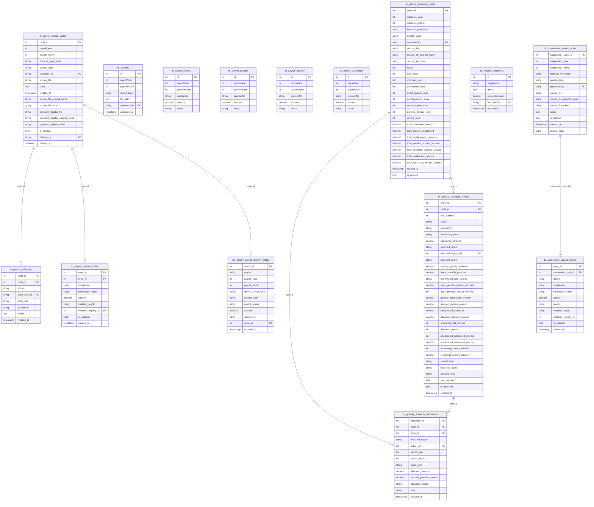

# Payroll ERD

Generated from `database/schema.sql` on 2026-05-28.

Payroll uploads, cycle reconciliation, suspension loads, and monthly registry status.

- Tables: 15
- Relationships shown: 7

## Tables Covered

- `tb_payrolls`
- `tb_payroll_pension`
- `tb_payroll_gratuity`
- `tb_payroll_arrears`
- `tb_payroll_suspended`
- `tb_payroll_upload_cycles`
- `tb_payroll_upload_entries`
- `tb_payroll_audit_logs`
- `tb_registry_payroll_monthly_status`
- `tb_suspension_upload_cycles`
- `tb_suspension_upload_entries`
- `tb_retained_payments`
- `tb_gratuity_schedule_cycles`
- `tb_gratuity_schedule_entries`
- `tb_gratuity_schedule_allocations`

## Mermaid ERD

