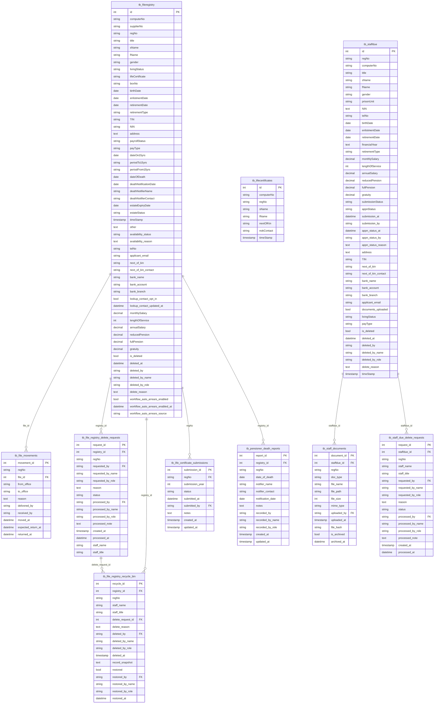

# Registry ERD

Generated from `database/schema.sql` on 2026-05-28.

Staff due intake, canonical pension registry, documents, file custody, and life-certificate records.

- Tables: 10
- Relationships shown: 8

## Tables Covered

- `tb_staffdue`
- `tb_staff_documents`
- `tb_staff_due_delete_requests`
- `tb_fileregistry`
- `tb_file_movements`
- `tb_file_registry_delete_requests`
- `tb_file_registry_recycle_bin`
- `tb_lifecertificates`
- `tb_life_certificate_submissions`
- `tb_pensioner_death_reports`

## Mermaid ERD

