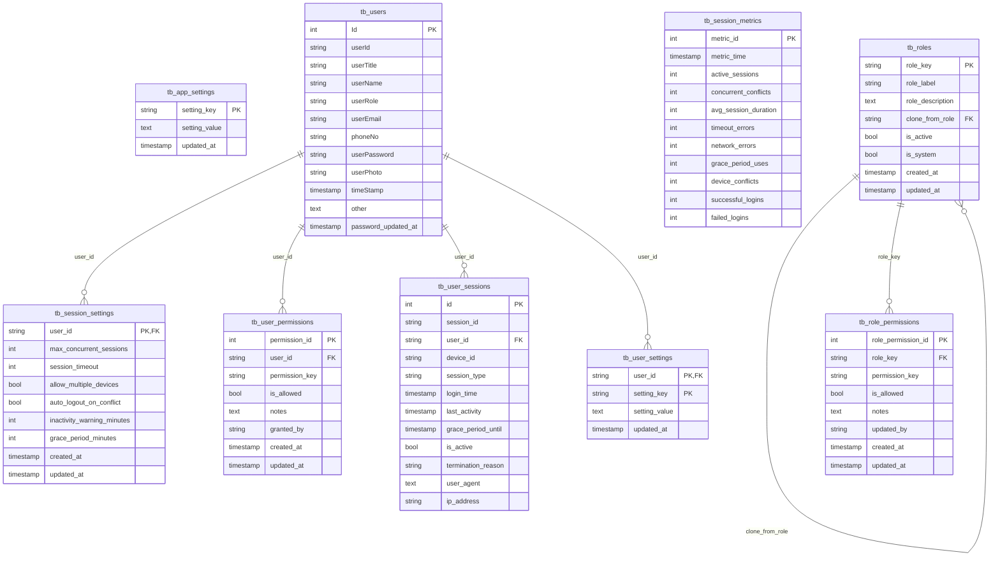

# Users & Access ERD

Generated from `database/schema.sql` on 2026-05-28.

Users, roles, permissions, sessions, and app-level access settings.

- Tables: 9
- Relationships shown: 6

## Tables Covered

- `tb_users`
- `tb_roles`
- `tb_role_permissions`
- `tb_user_permissions`
- `tb_user_settings`
- `tb_user_sessions`
- `tb_session_settings`
- `tb_session_metrics`
- `tb_app_settings`

## Mermaid ERD

